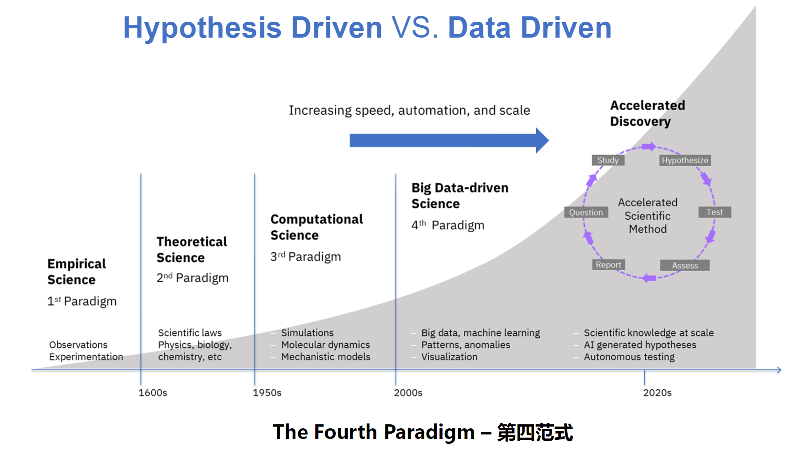

# 
Welcome to Wang Cong's homepage!

##        
一、生物信息学笔记

==特别注意==：本门课并非教授编程技能，而是训练学生**如何使用编程解决实际问题**。
### (一) **课程基本信息介绍**
  1. 先修课程要求：实际上并无硬性要求，只要具有**高数基础**，有一定**编程能力**，**接触过Linux**即可。
  2. 后续课程推荐：**《基于Python的科学与数值计算》**、《计算机程序设计基础 (Python)》、《Python程序设计进阶》。
  3. 课程基本安排
        | 周数 | 内容 |
        | :---: | :---: |
        | 1-4|Linux(bash)|
        |5-16|R|
        |11-16|Python|
  4. 参考资料以及实践教程：详见[教学大纲](https://365.kdocs.cn/l/caAbfIt5y8Fk)
    
 
### (二) **课程特色**
  1. 教学目标
     * 介绍基本概念和原理；
     * 介绍生物信息可以研究的问题和方向，从而引发实践和研究的兴趣；
     * ==构建学习和实践的框架==
  2. 学习方法（Peer Learning）——基于费曼学习法

  

    
  

   

### (三) **生物信息学（bioinformatics）与传统生物学**
   
<table>
  <tr>
    <th>生物信息学四步走</th>
    <td>Information</td>
    <td>Analysis</td>
    <td>Modeling</td>
    <td><strong>Question</strong></td>
  </tr>
  <tr>
    <th>传统生物学四步走</th>
    <td><strong>Question</strong></td>
    <td>Information</td>
    <td>Analysis</td>
    <td>Modeling</td>
  </tr>
</table>

&emsp;&emsp;如下图，传统生物学属于科学发展第三范式，生物信息学作为数据时代的产物则是进入到第四范式。

### (四) ==**算法(algorithm)与模型(model)**==
  1. 算法：
      * 排序算法： 快速排序、归并排序等
      * 动态规划算法： 矩阵链乘法、最长公共子序列等
  2. 模型：
      * 概率模型： 隐马尔可夫模型（HMM）、贝叶斯网络等
      * 机器学习模型： 线性回归、逻辑回归、神经网络等
  3. 算法与模型的区别：
      * **算法**是一种解决问题的步骤或方法
      * **模型**是算法作用于数据后对现实世界某种现象的抽象表示
      * 算法可以用来训练模型，模型可以用来预测和分析数据
### (五) **生物信息学应用**
  * 基因组学： 基因组测序、基因功能预测、变异分析等
  * 转录组学： RNA 测序、基因表达分析、可变剪接等
  * 蛋白质组学： 蛋白质结构预测、功能注释等
  * 代谢组学： 代谢物鉴定、代谢通路分析等
### (六) **生物信息学工具**
  * 序列分析工具： BLAST、Clustal Omega 等
  * 结构预测工具： PhyreStorm、AlphaFold 等
  * 功能注释工具： GO、KEGG 等
### (七) **生物信息学发展趋势**
  * 大数据驱动： 利用海量数据进行科学研究和临床应用
  * 人工智能： 利用深度学习等技术进行更精准的预测和分析

## 二、生物信息学习计划

### 第 1-4 周：Linux 基础与生物信息学应用
- **目标**：掌握 Linux 基本操作和生物信息学工具。
- **内容**：
  - 第 1 周：Linux 文件系统与基本命令（`ls`, `cd`, `mkdir`, `cp`, `mv`, `rm`）。
  - 第 2 周：文本处理工具（`grep`, `awk`, `sed`, `cut`, `sort`）。
  - 第 3 周：Shell 脚本编写与自动化。
  - 第 4 周：生物信息学工具安装与使用（如 FastQC、BLAST）。

### 第 5-10 周：R 语言基础与生物信息学分析
- **目标**：掌握 R 语言基础及其在生物信息学中的应用。
- **内容**：
  - 第 5 周：R 语言基础（变量、数据类型、函数、包管理）。
  - 第 6 周：数据导入与处理（`read.table`, `dplyr`）。
  - 第 7 周：数据可视化（`ggplot2`）。
  - 第 8 周：RNA-Seq 数据预处理（质量控制、标准化）。
  - 第 9 周：差异表达分析（`DESeq2`）。
  - 第 10 周：功能富集分析（`clusterProfiler`）。

### 第 11-16 周：高级分析与 Python 选择性使用
- **目标**：深入学习生物信息学分析，选择性使用 Python。
- **内容**：
  - 第 11 周：单细胞 RNA-Seq 数据分析（`Seurat`）。
  - 第 12 周：基因组变异分析（`VCFtools`, `snpEff`）。
  - 第 13 周：Python 基础（变量、数据类型、函数）。
  - 第 14 周：Python 数据处理（`pandas`, `numpy`）。
  - 第 15 周：Python 数据可视化（`matplotlib`, `seaborn`）。
  - 第 16 周：项目实践与总结（srt）。

---

清华大学  致理书院 
王聪 
cong-wan23@mails.tsinghua.edu.cn

    

        
    

        

